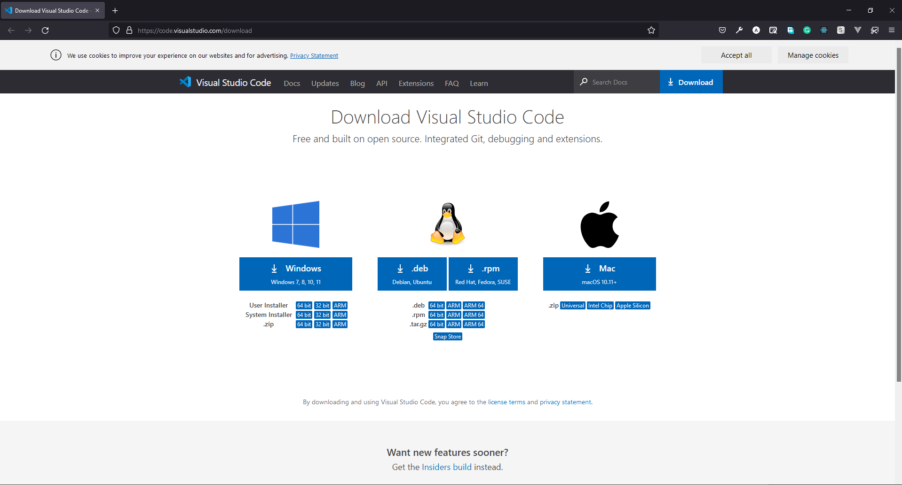
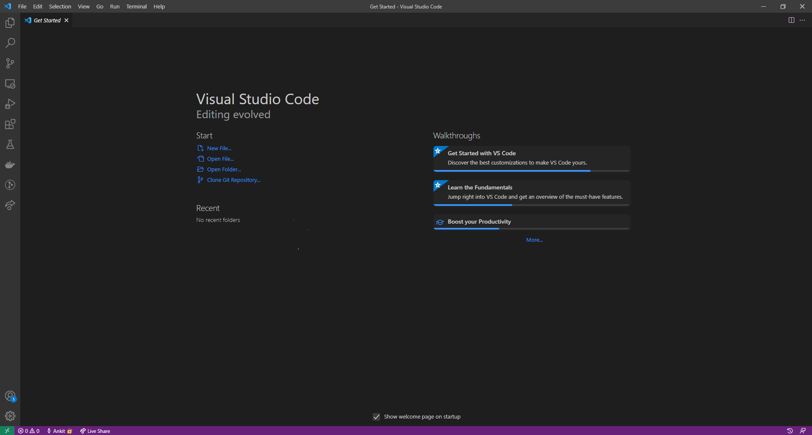
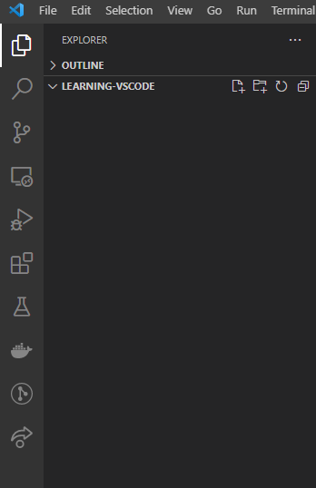

## Introduction
Visual Studio Code (or VS Code) is a free, open-source code editor. It is available for Windows, Linux and macOS. This page will give you information on:

- How to download and install VS Code
- Opening a folder in VS code
- Create a new script in VS Code
- Open a Terminal in VS Code


## Download
You can download VS Code from the URL: [https://code.visualstudio.com/download](https://code.visualstudio.com/download) by selecting the right platform.



To download VS code click on the respective icons, depending on your operating system.


## Installation {.tabset}

We give brief instructions of how to install VS Code on each major operating system. 
For more detailed instructions, you may visit [the VS Code documentation page](https://code.visualstudio.com/docs/setup/setup-overview).

### Windows

- Open the folder where you have downloaded VS code.
- You will find a installer (`VSCodeUserSetup-{version}.exe`). Run the installer and follow the setup steps. It will take a few minutes.
- **Important:** After installation, open VS Code and go to “File > Preferences > Settings”. In the search box at the top of the settings, search for "EOL". The top hit should give you an option called “EOL” with the default value "auto". Change this to “\n” (this will ensure that the files you edit on Windows are compatible with the Linux operating system).

### macOS

- Open the folder where you have downloaded VS code. It will be a `.zip` file.
- Extract the zip contents.
- After extracting you will see an app `Visual Studio Code.app`. Drag `Visual Studio Code.app` to the `Applications` folder, so that you will open this using the macOS Launchpad.

### Linux

- For Debian and Ubuntu based distribution, download the `.deb` file and then follow below instructions for installation.
    - Open up the terminal
    - Move to the directory where you have downloaded the `.deb` file.
    - Run the following command to install
    ```bash
    sudo apt install ./<file-name>.deb

    # Replace <file-name> with the name of the vs-code file you have downloaded.
    #
    # If you're on an older Linux distribution, you will need to run this instead:
    # sudo dpkg -i <file-name>.deb
    # sudo apt-get install -f # Install dependencies
    ```

- If you have downloaded the `.rpm` file, then follow below instructions for installation
    - Open up the terminal
    - Move to the directory where you have downloaded the `.rpm` file.
    - Run the following command to install
    ```bash
    sudo dnf install <file-name>.rpm

    # Replace <file-name> with the name of the vs-code file you have downloaded.
    ```


## Open a folder in VS Code

If you open VS code for the first time it will look like the following:




You can open any folder/directory into VS Code in the following ways:

- On the VS Code menu bar, choose **File > Open Folder...**.
- Then browse to the location where you have the folder/directory. Select the folder/directory (don't double click) and then select **Select Folder** to open the folder into VS Code.

If a folder/directory is open then it will look like the following:


:::note
If only a file is open on VS Code, you will see that the colour of the bottom bar is purple. If a folder/directory is, then the colour will be blue.
:::

## Create a new script in VS Code
Assuming you have opened a folder/directory in VS Code. On the left side of the VS Code window, you will see a pane called **Explorer**. Under Explorer, you will find the folder's name you have opened.


If you hover over the folder's name, you will see four icons appear. 



Starting from the left, they are for:

1. **Create New File** within the current folder.
1. **Create New Folder** within the current folder.
1. Refresh explorer.
1. Collapse explorer.

To create a new file click on the first icon (**New File**), and then type the name of the file with an extension of `.sh` and press `enter`.


In the centre, you will see that a new tab is open. You will see the title of this tab is the same as the name of your file.


Now you can begin your coding. Write the following code and save the file:

```bash
echo Hello World
```

After then, you need to save this file. You can save the file by pressing `ctrl` (on macOS `cmd`) + `S`.


## Open terminal in VS Code
VS Code comes with an integrated terminal that conveniently starts at the root of your workspace (this will be clear below). There are a few different ways to open the integrated terminal:

- Using Keyboard shortcut: Press `Ctrl`+ ` (ctrl + backtick character).
- Using VS Code menu bar: **View > Terminal**.

You will see that the integrated terminal opens at the bottom.


To learn more about the integrated terminal visit [https://code.visualstudio.com/docs/editor/integrated-terminal](https://code.visualstudio.com/docs/editor/integrated-terminal)
